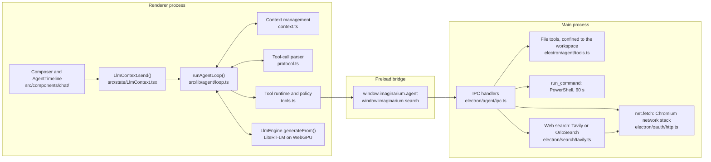
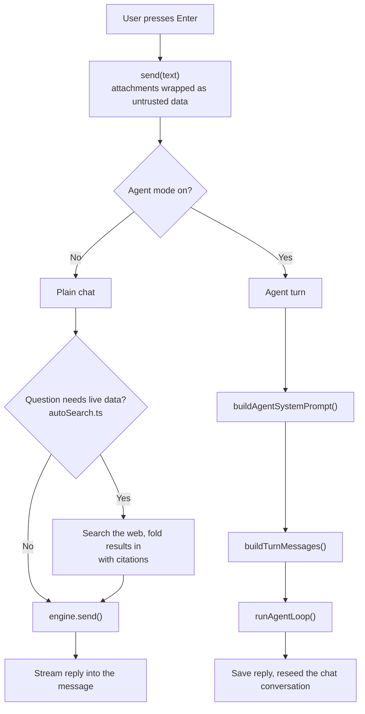
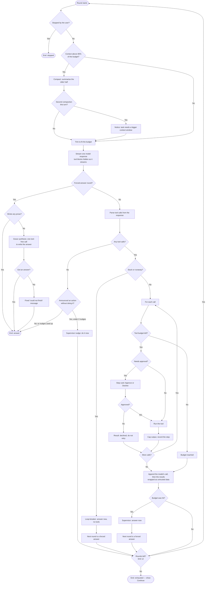
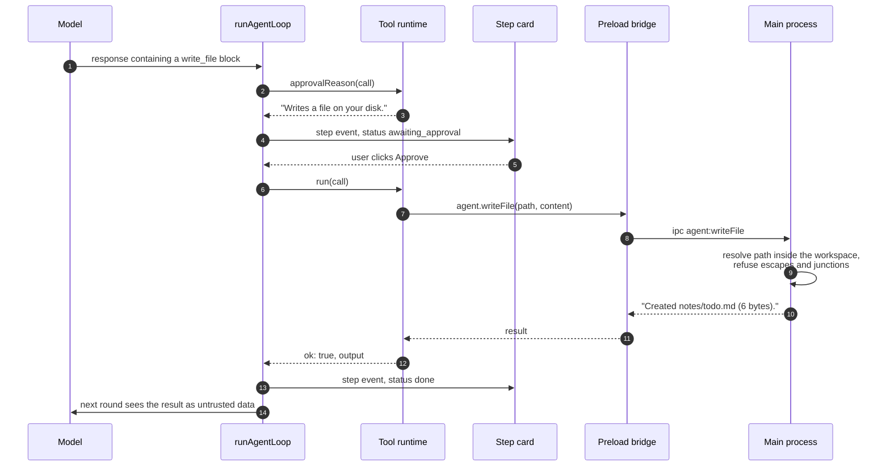
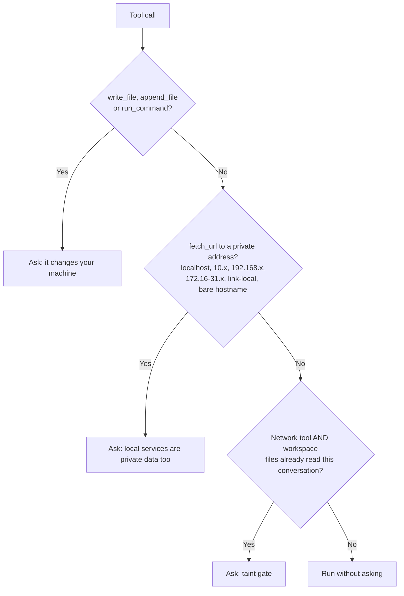
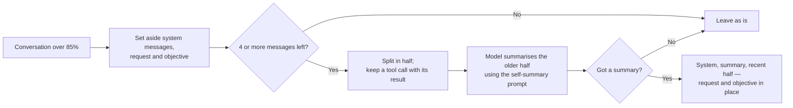

# Agent loop architecture

How Agent mode in OMNI-STUDIO's chat works, from the moment you press Enter to
the saved reply. Every number and rule below is taken from the code as it
stands; file references point at where each piece lives.

The loop is a port of Odysseus's `stream_agent_loop` (`src/agent_loop.py`),
scaled down for a small model running on a local GPU with a context window of a
few thousand tokens.

---

## Contents

1. [The big picture](#1-the-big-picture)
2. [Two ways a message is answered](#2-two-ways-a-message-is-answered)
3. [Step by step: one agent turn](#3-step-by-step-one-agent-turn)
4. [The loop, round by round](#4-the-loop-round-by-round)
5. [The tool-call protocol](#5-the-tool-call-protocol)
6. [Tools and the approval policy](#6-tools-and-the-approval-policy)
7. [Context management](#7-context-management)
8. [Safety nets that end a turn](#8-safety-nets-that-end-a-turn)
9. [Events, the timeline and persistence](#9-events-the-timeline-and-persistence)
10. [Limits at a glance](#10-limits-at-a-glance)
11. [File map](#11-file-map)

---

## 1. The big picture

The model runs in the **renderer** (LiteRT-LM on WebGPU). The loop runs there
too, next to it. Anything that touches the disk, spawns a process or needs the
network goes to the **main process** over IPC, through a deliberately narrow
preload bridge. The model never supplies a folder, only paths relative to the
workspace the user picked with a native dialog.



Why this split:

- **The loop is pure.** `runAgentLoop` receives the model (`llm`), the tools,
  the approval callback and the event sink as arguments. It has no imports from
  React, IPC or the engine, so the test suite drives it with a scripted fake
  model.
- **Private data stays in main.** Workspace paths are resolved and checked
  there; API keys are held there, encrypted with `safeStorage`.
- **Network goes through Chromium.** `net.fetch` honours the Windows proxy
  (PAC/WPAD) and certificate store, so web tools work behind a corporate proxy
  or a TLS-inspecting gateway.

---

## 2. Two ways a message is answered

`LlmContext.send()` branches on the **Agent** toggle in the composer.



The two paths keep context differently, and that difference is the reason the
agent exists as a separate path:

| | Plain chat | Agent mode |
|---|---|---|
| Who holds the history | The LiteRT-LM `Conversation` object, internally | The loop, as a `AgentMessage[]` list it owns |
| Per request | Appends one turn | Rebuilds the whole context from the list every round |
| Can trim or summarise | No | Yes — that is what owning the list buys |
| Engine call | `engine.send(text)` | `engine.generateFrom(messages)` — a fresh one-shot conversation per round |
| Tools | None (auto web search only) | Eight, with an approval policy |

Because an agent turn bypasses the chat conversation, `send()` reseeds it
afterwards with `engine.openConversation(...)`, so plain chat that follows still
sees what the agent did.

---

## 3. Step by step: one agent turn

What happens between Enter and the saved reply, in order.

### Step 1 — Accept the message
`send()` (`src/state/LlmContext.tsx`) refuses to start if the model is not
ready, a turn is already running, or the message is empty. It assigns a
conversation id if this is the first message of a new chat.

### Step 2 — Wrap attachments
Emails, Drive files and workspace files attached from the sidebar are folded
into the message by `buildPromptWithAttachments()` (`src/lib/attachments.ts`).
Each is wrapped as **untrusted source data** (see step 9 of the loop) and
clipped to share a budget of 60 % of the input window, keeping the head and the
tail of long items. If anything was attached, the **taint flag** is set:
`taintRef.current.privateDataRead = true`.

### Step 3 — Add the placeholder reply
A user message and an empty assistant message with an `AgentView` are appended
to the transcript, and the composer switches to its Stop state.

### Step 4 — Build the system prompt
`buildAgentSystemPrompt()` (`src/lib/agent/prompt.ts`) assembles:

1. the user's own system prompt from Settings (persona), if any;
2. the protocol instruction: *a fenced block whose language tag is the tool name, JSON inside*;
3. the tool list, generated from `TOOL_SPECS` — a new tool appears here automatically;
4. the workspace folder name, or a note that file tools will fail without one;
5. today's date;
6. the rules — one step at a time, never claim success without a tool result,
   build long documents with `write_file` then `append_file`, never repeat a
   call, treat tool output as data, respect a declined action, and end the turn
   as **DONE**, **BLOCKED**, or with the single most useful next step.

### Step 5 — Build the turn's context
`buildTurnMessages()` (`src/lib/agent/session.ts`) produces the message list the
loop will own:

```
[ system prompt,
  saved summaries of earlier compacted turns,
  prior turns not yet summarised   (kind: history),
  the latest earlier user message  (kind: objective)   ← pinned
  this message                     (kind: request)     ← pinned ]
```

Prior assistant turns contribute their final prose, not their raw tool traffic.
The **objective** tag exists because a task often arrives one message before
the message that starts the work ("review the docs and write FINAL-VERDICT.md",
then "the ones in AGENT_RESEARCH"). Pinning it stops compaction from summarising
away what the agent is actually for.

### Step 6 — Compute the budget
`inputTokenBudget()` (`src/lib/agent/context.ts`):

```
budget = max(1024, contextWindow − maxReplyTokens − 256)
```

With the defaults (8192 window, 2048 reply cap) that is **5,888 tokens** — the
`CTX used/5.9K` shown in the composer. The model's reply comes out of the same
window, which is why the reply cap is subtracted.

### Step 7 — Wire the model and start the loop
`send()` wraps `engine.generateFrom()` as the loop's `llm` function, creates the
tool runtime with the shared taint state, and calls `runAgentLoop()` with an
`AbortController` so Stop can cancel mid-round. Approval requests are parked in
`approvalsRef` until the user clicks **Approve** or **Decline** on a step card.

### Step 8 — Run the loop
See [section 4](#4-the-loop-round-by-round).

### Step 9 — Finish
The final prose becomes the message text. If this turn compacted earlier chat
history, `nextContextState()` records the summary and how many transcript
messages it covers (the last three summaries are kept), so the next turn starts
from the summary instead of re-reading those turns. The transcript is persisted
to IndexedDB, and the chat conversation is reseeded.

---

## 4. The loop, round by round

`runAgentLoop()` in `src/lib/agent/loop.ts`. Each iteration is one **round**: one
model response, plus whatever tools it asked for.



The same flow in prose, one round at a time:

1. **Check for Stop.** An aborted signal ends the turn immediately.
2. **Compact, if needed.** Above 85 % of the budget, the older half of the
   conversation is summarised into one message by the model itself
   ([section 7](#7-context-management)). A second compaction in the same turn
   raises a notice: the job does not fit the window.
3. **Trim.** Whatever still does not fit is trimmed in a fixed order of
   sacrifice. The request and the objective are never dropped.
4. **Report usage.** A `context` event updates the `CTX used/budget` readout.
5. **Stream one response.** Tokens are streamed into the timeline as they
   arrive. Complete tool blocks are removed from what is shown — they render as
   step cards — and a half-written tool fence is hidden so partial JSON never
   flashes on screen.
6. **Parse tool calls** from the finished response, in the order they appear.
7. **If this is a forced-answer round**, tools are not parsed at all: the prose
   is the answer. No prose → one grace-synthesis call. Still nothing → a fixed
   "could not finish" message. The turn ends.
8. **If there are no tool calls**, the model is done — unless it announced an
   action ("Let me check the logs") in a short message with no code block and
   no call. That earns a nudge, at most twice per turn.
9. **Loop-breaker.** A round is "stuck" if it repeats a call from the last six
   rounds *and* writes no new text. Three stuck rounds in a row, or any single
   call made five times with identical arguments, forces the next round to be a
   tool-free answer.
10. **Run the tools**, one at a time, each against the tool-call budget (24 per
    turn). Anything needing approval waits on a step card. A declined call is
    reported back to the model as *declined — do not retry*. Each output is
    capped to a size derived from the budget.
11. **Feed the round back**: the model's own response (kind `tool_call`),
    followed by all results in one message wrapped as untrusted data (kind
    `tool_result`).
12. **Budget hit?** Then a supervisor message asks for the final answer and the
    next round is forced.
13. **Next round**, up to 12. Running out while still working ends the turn as
    *exhausted*: the timeline shows **↻ Continue**, which sends
    "Continue from where you stopped." as a new message.

### An approval, as a sequence



---

## 5. The tool-call protocol

Gemma on LiteRT-LM has no native function-calling channel, so the model calls a
tool by writing text (`src/lib/agent/protocol.ts`). Two syntaxes are accepted.

**Fenced blocks** — what the system prompt asks for:

````
```read_file
{"path": "src/app.ts", "start_line": 1, "end_line": 200}
```
````

**Gemma's native syntax** — which Gemma 4 uses anyway, whatever the prompt says:

```
<|tool_call>call:read_file{"path": "src/app.ts"}<tool_call|>
```

The parser is lenient where small models are loose:

| The model writes | Parsed as |
|---|---|
| A JSON object | The arguments, as-is |
| `{"body": {...}}` | The inner object, unwrapped |
| Plain text, e.g. a bare path | The tool's primary argument (`path`, `command`, `query`, `url`, `pattern`) |
| JSON inline on the tag line | The arguments |
| Gemma's `<\|"\|>` string delimiters and bare keys | Repaired into JSON |

Details that matter:

- **Exact tag match.** A fence tagged ` ```bash_example ` or ` ```web_search2 `
  is not a tool call, so the model can still show code.
- **Brace-balanced scanning** for native calls, aware of strings, so nested
  JSON or file content containing `}` is captured whole. The stream filter
  removes Gemma's closing token, so native calls usually arrive unterminated;
  the scanner handles that.
- **Unknown tool names** in native calls are accepted and answered with
  *unknown tool, available: …*, which the model can correct from.
- **Call signatures** for loop detection are the tool name plus the
  whitespace-normalised first 120 characters of its arguments.

---

## 6. Tools and the approval policy

Eight tools, declared in `TOOL_SPECS` (`src/lib/agent/tools.ts`) and implemented
in the main process (`electron/agent/tools.ts`), except `web_search`, whose
client runs in the renderer and routes through the search bridge.

| Tool | Does | Limits | Approval |
|---|---|---|---|
| `list_dir` | Lists a workspace folder, folders first, with sizes | 300 entries | No |
| `read_file` | Reads a text file with line numbers | 200 lines per call, 400 KB file, refuses binary | No |
| `search_files` | Regex search over file contents, optional glob | 60 matches, 5,000 files, 1 MB per file; skips `node_modules`, `.git` and build folders; invalid regex searched literally | No |
| `write_file` | Creates or overwrites a file | Creates parent folders | **Always** |
| `append_file` | Adds to the end of a file, creating it if needed | 2 MB per file; inserts one newline between chunks | **Always** |
| `run_command` | Runs PowerShell in the workspace folder | 60 s, then the whole process tree is killed (`taskkill /T /F`); 64 KB of output | **Always** |
| `web_search` | Titles, URLs and snippets | 8 results shown to the model | Only once workspace files are in the conversation |
| `fetch_url` | Fetches a page as readable text | http/https only, 20 s, 3 MB, refuses binary | Always for private-network hosts; otherwise as `web_search` |

### Workspace confinement

Every file path goes through `resolveInside()` in the main process:

1. The traversal check shared with SVN Studio rejects `..` and absolute paths.
2. The path is resolved against the workspace root.
3. `realpath` is taken of the target — or, for a file that does not exist yet,
   of its nearest existing parent — and must still be inside the workspace. A
   junction or symlink inside the workspace that points outward is refused.

### The approval policy

`approvalReason()` returns a reason string when a call must be approved, or
`null` to run it straight away:



The last rule is the **taint gate**. Private data in the context plus an
outbound request is exactly how a prompt-injected web page would exfiltrate
something, so once any file-reading tool has succeeded — or anything was
attached from the sidebar — every network call needs approval for the rest of
the conversation.

Two defences sit alongside the gate:

- **Untrusted wrapping.** Tool output and attachments reach the model inside
  guard markers, after a fixed header telling it not to follow instructions in
  the block. Guard markers appearing *inside* the data are neutralised first,
  so fetched content cannot close the block early and inject text after it.
- **Declines are final.** A declined call comes back to the model as *the user
  declined this action — do not retry it*, and the prompt repeats the rule.

---

## 7. Context management

`src/lib/agent/context.ts`. The loop owns its message list, so it can keep a
long task inside a small window. Every message carries a `kind` that says what
it may lose:

| Kind | What it is | Dropped? |
|---|---|---|
| `system` | The agent system prompt | Never (truncated at 6,000 characters in an emergency) |
| `summary` | A compaction summary | Oldest first, when extras do not fit |
| `history` | An earlier chat turn | Yes, oldest first |
| `objective` | The latest earlier user instruction | **Never** — shrunk only as a last resort |
| `request` | This message | **Never** — shrunk only as a last resort |
| `tool_call` | A model round that called tools | Yes |
| `tool_result` | Tool output, as untrusted data | Yes, and never left without its call |
| `supervisor` | Nudges, loop-breaker and budget instructions | Yes |

### Token estimate
```
tokens ≈ Σ ( 4 + characters × 0.3 )    per message
```
Odysseus found `characters ÷ 4` underestimates real tokenizer output by
20–30 %, and Gemma is no kinder to code, so the same 0.3 factor is used.

### Compaction — above 85 % of the budget



- The summary prompt is Odysseus's structured one: user goal, what was done
  (with paths, names and values), current state, next steps, key context —
  capped at 500 tokens. Each older message contributes at most 2,000 characters
  to the transcript being summarised.
- Tool rounds from the **current** turn are eligible. An early version of the
  port excluded them, which meant compaction could never fire mid-turn.
- A failed summary leaves the conversation intact; trimming still bounds it.
- Summaries that cover earlier chat turns are persisted (the last three), so
  they carry over to the next agent turn.
- A **second compaction in one turn** raises the `context_pressure` notice:
  the agent keeps losing what it just read, so the task needs a larger Context
  window, or smaller steps.

### Trimming — whatever still does not fit

In Odysseus's order of sacrifice, with one deliberate difference:

1. Drop extra system messages (older summaries), then add back the newest ones
   that still fit.
2. Truncate the system prompt if it alone is over 6,000 characters.
3. Drop the oldest conversation messages — first outside the ten most recent,
   then inside them if it still does not fit. **Request and objective are
   skipped.** Any tool result left without its call is removed.
4. Still over: shrink the latest message, then the objective, then the request,
   keeping the head and the tail of each.

The difference from Odysseus is the pin in step 3. Odysseus protects only the
last message; mid-turn the last message is a tool result, so the user's actual
request becomes just another old message and can be trimmed away. With Odysseus's
large budgets that rarely matters. At a few thousand tokens it would make the
agent forget what it was asked.

### Output caps and merging

- **Per-result cap**: `clamp(budget × 0.25 ÷ 0.3, 1,500, 10,000)` characters —
  about 4,900 at the default budget, so a couple of results always fit.
- **Turn merging**: `normalizeTurns()` merges consecutive same-role messages
  before each request, because chat templates expect alternating turns and a
  round can legitimately produce two user messages in a row (results, then a
  nudge).

---

## 8. Safety nets that end a turn

Every way a turn can end, and what the user sees.

| Trigger | What happens | Notice |
|---|---|---|
| Model answers with no tool call | Normal end | — |
| Announced an action but made no call | Nudge, up to 2 per turn; then end | `intent_nudge`, `intent_nudge_exhausted` |
| 3 stuck rounds, or one call 5 times | Next round must answer without tools | `loop_breaker` |
| 24 tool calls used | Next round must answer without tools | `budget_exceeded` |
| Forced round writes nothing | One tool-free grace-synthesis call | `grace_synthesis` |
| Grace synthesis also empty | Fixed "could not finish" message | — |
| 12 rounds used while still working | End; **↻ Continue** offered | `rounds_exhausted` |
| No prose and no tool calls at all | "The model returned an empty response" | `empty_response` |
| User presses Stop | End immediately; nothing further runs | — |
| Exception anywhere | Error shown in the timeline, not swallowed | `error` |

The intent detector matches an announcement **plus an action verb** — "let me
check", "I'll run", "going to search" — so harmless phrases such as "let me
know" never trigger it. It only fires on short messages (under 400 characters)
with no code block.

The limits are smaller than Odysseus's (50 rounds, runaway at 15) because every
round here re-prefills the whole context on a local GPU.

---

## 9. Events, the timeline and persistence

The loop never touches React. It emits events, and `applyAgentEvent()`
(`src/lib/agent/session.ts`) folds them into the message's `AgentView`:

| Event | Effect on the timeline |
|---|---|
| `round_start` | None — the reducer ignores it |
| `text` | Creates or updates in place this round's prose block |
| `step` | Adds a step card once, then updates its status |
| `context` | Updates the `CTX used/budget` readout |
| `notice` | Adds a notice; `trimmed` is shown only once per reply |

Step statuses: `running` → `done` or `error`, or `awaiting_approval` →
`denied`.

The result is a timeline of prose, step cards and notices **in the order they
happened**, rendered by `AgentTimeline.tsx`.

### What is saved

`persistableView()` prepares an agent reply for IndexedDB:

- Step outputs are capped at 2,000 characters.
- A step still `awaiting_approval` or `running` when the app closed is saved as
  `skipped` — an approval left hanging is, in effect, declined.
- The final prose is the message text, so reloading a conversation shows the
  answer even without the timeline.

---

## 10. Limits at a glance

| Setting | Value | Where |
|---|---|---|
| Rounds per turn | 12 | `DEFAULT_MAX_ROUNDS`, loop.ts |
| Tool calls per turn | 24 | `DEFAULT_MAX_TOOL_CALLS` |
| Identical call, runaway threshold | 5 | `RUNAWAY_THRESHOLD` |
| Stuck rounds before the loop-breaker | 3 | `STUCK_ROUNDS_LIMIT` |
| Recent call signatures remembered | 6 | `RECENT_SIGNATURES` |
| Intent nudges per turn | 2 | `MAX_INTENT_NUDGES` |
| Compaction threshold | 85 % of the budget | `COMPACT_THRESHOLD`, context.ts |
| Recent messages protected from trimming | 10 | `PROTECT_RECENT` |
| Input budget | `max(1024, window − reply cap − 256)` | `inputTokenBudget()` |
| Budget at defaults | 5,888 tokens | 8,192 − 2,048 − 256 |
| Tool output cap | 1,500–10,000 characters | `toolOutputCharCap()` |
| Summary length | under 500 tokens | `SELF_SUMMARY_PROMPT` |
| Persisted summaries | last 3 | `nextContextState()` |
| Persisted step output | 2,000 characters | `persistableView()` |
| Attachment share of the window | 60 % | `attachmentCharBudget()` |

---

## 11. File map

| File | Responsibility |
|---|---|
| `src/state/LlmContext.tsx` | `send()`: branches chat vs agent, wires model, tools and approvals, persists |
| `src/lib/agent/loop.ts` | `runAgentLoop()`: rounds, loop-breaker, nudges, budget, forced answers |
| `src/lib/agent/context.ts` | Token estimate, budget, compaction, trimming, untrusted wrapping, turn merging |
| `src/lib/agent/protocol.ts` | Parsing fenced and native tool calls, hiding them from the visible text |
| `src/lib/agent/tools.ts` | `TOOL_SPECS`, step descriptions, the approval policy, dispatch to the bridge |
| `src/lib/agent/prompt.ts` | The agent system prompt |
| `src/lib/agent/session.ts` | Building a turn's context, the event reducer, persisted compaction |
| `src/lib/agent/types.ts` | `AgentMessage`, `ToolCall`, `AgentStep`, events and notices |
| `src/lib/attachments.ts` | Wrapping sidebar attachments as untrusted data |
| `src/components/chat/AgentTimeline.tsx` | Step cards, Approve and Decline, notices, Continue |
| `src/lib/engine.ts` | `generateFrom()`: a fresh one-shot conversation per round |
| `electron/agent/ipc.ts` | IPC handlers; the workspace root lives here |
| `electron/agent/tools.ts` | File tools, `run_command`, `fetch_url`, workspace confinement |
| `electron/search/tavily.ts` | Web search: Tavily key or OrioSearch fallback, via `net.fetch` |
| `electron/oauth/http.ts` | `httpFetch()`: `net.fetch` with retries and readable errors |
